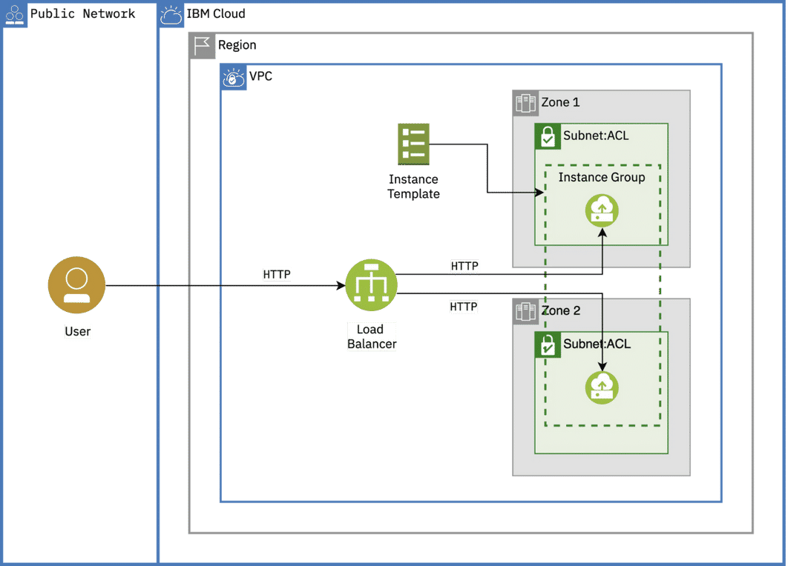

# Cheatsheet for exam C1000-118 - IBM Cloud Professional Architect
This repo is intended to help in the preparation for the exam C1000-118: IBM Cloud Professional Architect

## Who is a IBM Cloud Architect ?

The IBM Cloud professional architect should be able to:
    - Exhibit understanding of cloud concepts and architectural principles
    - Assess current state and architect future environment 
    - Elaborate solution recommendations

## Section 1: IBM Cloud Compute Options ( 20% )
### Describe and differentiate the various compute options available on IBM Cloud
    *   VPC: Virtual Private Cloud. Isolates portions of the public cloud.
        - Bring your IPs
        - Public and private gateways
        - Security Groups
        - Access control List ( ACLs )
        - Routing

#### VPC Components:
    - VSI - Virtual Server Instance
    - Network Interface: up to 5 NI per VSI. 1 floating IP per VSI. 
    - Floating IP address
    - Instance Template+Instance Group in order to create VSI, having the same characteristics
    - Autoscale for VPC: scale instance group base on scalling policies

#### Subnet
    - CDIR - Classic inter-domain Routing for IPs range within subnet
    - <IPv4>/number where the number identifies how many IPs will be available in the subnet.
    - Using IPs outside of the range specified in RFC-1918 might result in non reachable subnet
    - BYOIP - Bring Your Own IP - Custom IPs can be attached to VPC

#### CDIR Classic inter-domain routing
    - IPv4 -> 32 bit

#### Routing tables
    - Egress
    - Ingress
    - System routing tables -> default routing when no Routing table is configured

### Components of High availability design
    Span the workloads across several availability zones by:
    - VSI in several availability zones
    - Load balancer in order to spread the workload across several VSI

#### Load balancer
    Two types: Applications LB and Network LB
    Load balancing methods:
        - Round-robin: all the backends receives the same amount of connections/request
        - Weighted Round-robin: The amount of connections/requests to forward is configured in %
        - Least connections: The next backend to receive a connection/request is the one that received less in a portion of time.

### Describe IBM Cloud for VMware Solutions offerings and their key options
    - Expands customer's VMware datacenter in IBM Cloud or on-premises
    - Extends capabilities by adding: backup, capacity administration, migration, disaster recovery

#### Deployments Offerings
    - Standard and customizable VMware offering. It offers 5 IPs address. 

### Describe IBM Cloud Container Platforms [IBM Container Registry Service]
    

### Describe the capabilities of IBM Power Systems Virtual Servers
### Describe IBM Cloud for VMware Solutions offerings and their key options
### Describe the capabilities of IBM Cloud Functions

## Section 2: Design Solutions Based on Application Platform Capabilities ( 24% )
### Design Cloud and Hybrid Cloud solutions 
### Design resilient solutions on classic, VPC, OpenShift platforms
### Design automation for the application platform using IBM Cloud Schematics  
### Identify the core architecture of IoT solutions using the IBM Internet of Things Platform  
### Integrate Watson AI services to add AI capabilities to IBM Cloud solutions  
### Design integrated solutions

## Section 3: Data Analytics and Data Management ( 8% )
### Design solutions incorporating the options and capabilities of analytics services on IBM Cloud  
### Design solutions incorporating the options and capabilities of Database services on IBM Cloud  

## Section 4: IBM Cloud Storage Options ( 13% )
### Design IBM Cloud solutions using appropriate storage options  
### Describe the options and capabilities of classic storage on IBM Cloud
### Describe the options and capabilities of VPC storage on IBM Cloud
#### Block storage on VPC
    - Supports all Virtual Server profiles
    - 

### Describe the options and capabilities of IBM Cloud Object Storage  
### Describe the options and capabilities of storage for Power virtual server instances  
### Describe the storage options for Red Hat OpenShift on IBM Cloud and IBM Cloud Kubernetes Service

## Section 5: IBM Cloud Networking Options ( 11% )
### Describe Hybrid Cloud Networking Capabilities

#### Connecting on-premises to Cloud:
    - With internet ----> VPN and secure gateway
    - Without internet -> DirectLink and GRE as alternative to VPN
#### VPN
    - Secure tunnel between endpoints
    - End to End encryption
#### DirectLink
    - 1.0 for Classic infrastructure
    - 2.0 for VPC
    - Secure and speed up connection between privates endpoints
    - Ideal for data migration, replication, backup and disaster recovery
    - DirectLink Dedicated: A fiber-based connection to datacenters close to IBM's PoPs
    - DirectLink Connect: customers can connect to private cloud through encrypted connection in the IBM's shared network 
    - Speed up to 5 gbps
    - Limitations: 
#### Secure Gateway
    - Allows to secure connect applications after installing a lightweighted SecureGateway
#### IBM Gateway Appliance
    - Customer can administrate physical and logical network rules
    - It offers: Enterprise grade routing, VPN, Firewall, Network Address Translation ( NAT )
    - IBM Cloud Firewall
    - IBM Cloud Load Balancers
#### Global Load Balancer
    Distribute the requests across several regions by using DNS. 
    The prefered method is to address the request to the closer location, improving latency
    Depending on the customer need's, other options might be available, such as the case of statics content serving (images, video,..) 
where a better solution can be using a Content Delivery Network ( CDN )
#### Load balancng Steering modes:
    - Failover: The LB redirect the workload from unhealthy endpoint to healthy ones
    - Dynamic: The LB check for closer and healthy endpoint to redirect traffic
    - GEO: The LB redirect traffic based on geolocation of the requester
#### Content Delivery Network ( CDN )
    - Network of servers storing or caching files across globally located datacenters
    - The closest locations serves the content to the requester, improving latency
    - Top CDN providers: Akamai, MaxCDN, Cloudflare, Rackspace, Incapsula
#### IBM CDN versus IBM CIS
    - IBM CDN serves content over Akamai network. It adds extra protection.
    - IBM CIS run over Cloudflare. It provides global load balancers and improves performance of web applications.
#### Bring your Own Ip - BYOIP
    - Solution for connecting existing network to IBM Cloud environments
    - IBM Cloud works with a common range if IPs, such as 10.0.0.0/8, that might conflic with existing datacenters.
    - NAT - implemented in customer network in order to translate customer's IPs in IBM Cloud environment

### Apply appropriate Cloud Native Connectivity
#### 

### Apply appropriate VPC Connectivity
    - IBM Cloud Direct Link Dedicated ( 2.0 ): Low latency, high throughput connection from/to IBM Cloud to one external conection or    multi-protocol label switching ( MPLS ) network
    - IBM Cloud Direct Link Connect ( 2.0 ): Connection between IBM Cloud and external on-promises datacenter by using external service provider. Use case is a customer not requiring 5Gbps bandwidth connection.
    - VPN for VPC: Secure tunnel between IBM Cloud and external datacenter

#### Transit Gateway + Direct Link Dedicated
    - Connect external customer's datacenter to IBM Cloud VPC bypassing public network, which reduce points of failure due to the connection go through less hops.

#### Transit Gateway
    - Single point to interconnect IBM Cloud VPCs and Classic Infraestructure and/or external datacenters
    - Faster connection between VPCs and IBM Cloud regions because It avoid external hops
    - No Feds for data movement between IBM Cloud regions
    

### Utilize Cloud Internet Services appropriately 

## Section 6: IBM Cloud Security Options ( 13% )
### Explain IBM Cloud Security features
### Describe IBM Cloud encryption and key management services

## Section 7: IBM Cloud Resiliency Features ( 5% )
### Describe the benefits of IBM Cloud multi-zone and multi-region architecture

## Section 8: Observability Capabilities ( 6% )
### Demonstrate knowledge of monitoring and alerting capabilities
    - 

### Demonstrate knowledge of logging capabilities  
### Describe the features and use cases for IBM Cloud Flow Logs for VPC  
